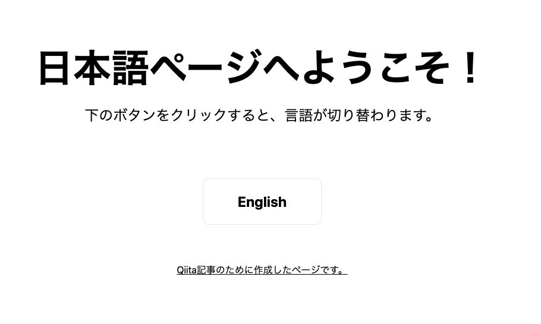

# i18n-projects

i18n の設定を反映させた、シンプルなアプリです。

このリポジトリは以下の Qiita に投稿した記事の、例として作成しています。
合わせてお読みいただけると幸いです。

[Qiita 記事｜ Next.js アプリで国際化（i18n）する方法]()

## 実行方法

### ① このリポジトリを任意のフォルダにクローンしてください。

```
git clone https://github.com/AkiUnleash/i18n-sample.git
```

### ② 以下をプロジェクト直下で実行してください。

```bash
# ビルド
yarn build

# ローカルサーバー起動
yarn start
```

### ③Localhost をブラウザで開いてください。

[http://localhost:3000/](http://localhost:3000/)

## 操作方法

以下のような画面が表示されます。

下の、English ボタンを押すと、言語の切り替えが確認できます。



## 注目してほしいコード

- pages/index.tsx … コンポーネントを表示
- service/i18n.ts … i18n の詳細設定
- next.config.js … 言語の種類等の設定

## Author

[Aki Unleash (Akio Yano)](https://twitter.com/AkiUnleash)
